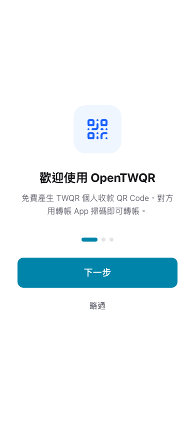
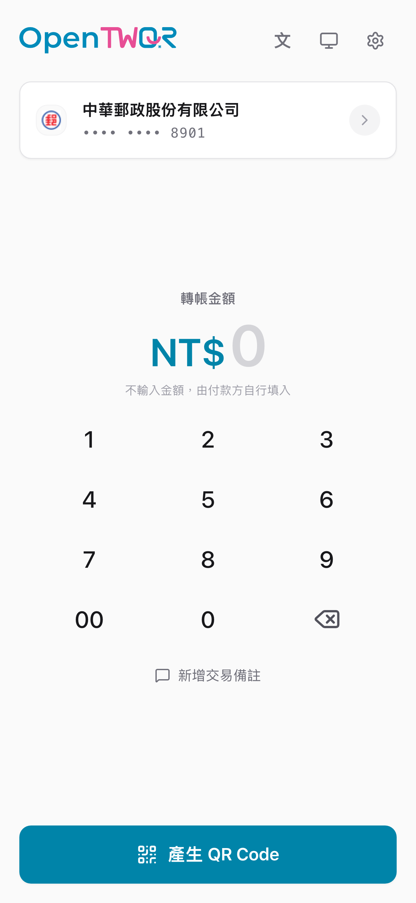

# OpenTWQR

[English](README-EN.md) ·
[繁體中文](README.md)

**Generate TWQR personal payment QR Codes instantly on your phone.**

Completely free, open source, no sign-up required — account data is stored only on your own device.

 

<table>
  <tr>
    <th colspan="2">📱 Mobile</th>
  </tr>
  <tr>
    <td align="center">
      <picture>
        <source media="(prefers-color-scheme: dark)" srcset="public/screenshots/welcome-mobile-dark.png" />
        
      </picture>
       
      Welcome Screen
    </td>
    <td align="center">
      <picture>
        <source media="(prefers-color-scheme: dark)" srcset="public/screenshots/receive-mobile-dark.png" />
        
      </picture>
       
      Receive Screen
    </td>
  </tr>
  <tr>
    <th colspan="2">🖥️ Desktop</th>
  </tr>
  <tr>
    <td align="center" colspan="2">
      <picture>
        <source media="(prefers-color-scheme: dark)" srcset="public/screenshots/receive-desktop-dark.png" />
        
      </picture>
       
      Receive Screen
    </td>
  </tr>
</table>

 

<a href="https://pay.garyellow.app"><strong>Try it now →</strong></a>

 

> [!TIP]
> You can also add the website to your home screen and use it like a native app — it works offline too.

> [!IMPORTANT]
> **This is a community open-source project and is not affiliated with the official TWQR standard (FISC - Financial Information Service Co., Ltd.) in any way.** OpenTWQR only generates QR Codes that conform to the TWQR specification and does not process any financial transactions. See the [Trademarks & Disclaimer](#trademarks--disclaimer) section below for details.

---

## What is TWQR?

**TWQR (Taiwan QR Code)** is a unified QR Code payment standard developed by the Financial Information Service Co., Ltd. (FISC). It standardizes the QR Code format across domestic banks and electronic payment institutions in Taiwan. Most banks' mobile apps now support scanning TWQR-format QR Codes for transfers and payments.

OpenTWQR lets you quickly generate personal payment QR Codes that comply with the TWQR standard — the payer simply scans the code with their own banking app, and the transfer is done. No additional app installation required.

> [!NOTE]
> TWQR is a QR Code **format standard**, while Taiwan Pay is a **payment app** launched by FISC. They are not the same thing. QR Codes generated by OpenTWQR can be scanned by any banking or e-payment app that supports the TWQR standard, not just Taiwan Pay.

## Features

- **Quick Payments** — Select an account, enter an amount, and generate a payment QR Code with one tap
- **Quick QR** — Generate a QR Code instantly by entering a bank code and account number, no saved account needed
- **Multi-Account Management** — Support multiple bank accounts with nicknames for quick switching
- **Bank Icons** — Automatically displays official bank icons, with the option to set custom icons
- **QR Display Settings** — Customize the center logo (OpenTWQR / bank icon), name label, and bank name display
- **Secure Sharing** — Share payment codes via encrypted links with optional password and expiration
- **Backup & Transfer** — Export encrypted backup strings to easily transfer data to other devices
- **Offline Ready** — Installable as a PWA; generates payment codes without an internet connection
- **Dark Mode & App Lock** — Light / Dark / System theme modes; enable device authentication (Face ID, fingerprint, etc.) to protect account data
- **Custom Accent Color** — Choose your preferred accent color from presets or a hue slider with live preview

## Privacy & Security

| | |
| :--- | :--- |
| **Data Storage** | All account data is stored solely on your device and is never sent to any server. |
| **Share Links** | End-to-end encrypted with AES-256-GCM. The decryption key remains in the URL fragment and never reaches the server. |
| **Password Protection** | Share links can be password-protected using PBKDF2 with 600,000 iterations to resist brute-force attacks. |
| **Link Expiration** | Links can be set to expire automatically after 10 minutes, 1 hour, or 1 day. |
| **Open Source** | The full source code is publicly available for review and contribution. |

## FAQ

<strong>How is this different from the Taiwan Pay app?</strong>

 

Taiwan Pay is a payment app by FISC that supports purchases, transfers, and bill payments. OpenTWQR only **generates payment QR Codes** so that others can scan and transfer money using their own banking app. It is not a payment app, does not process any transactions, and does not require you to log in to your bank account.

<strong>Does the payer need to install OpenTWQR?</strong>

 

No. The payer only needs any banking or e-payment app that supports TWQR to scan the QR Code and complete the transfer.

<strong>Is my data safe?</strong>

 

All account data is stored entirely on your device (in the browser's IndexedDB) and is never uploaded to any server. Share links use end-to-end encryption — even if a link passes through a server, the server cannot access your account information.

<strong>Why is no backend server needed?</strong>

 

OpenTWQR is a fully client-side application. Everything runs in your browser: account data is stored in a local database, QR Codes are computed on-device, and encryption/decryption happens client-side. The server only serves the static web files and never touches any user data.

<strong>How often is the bank list updated?</strong>

 

The financial institution list is primarily sourced from public data provided by the Financial Supervisory Commission (FSC) Banking Bureau, covering domestic banks, foreign banks, credit cooperatives, Mainland Chinese banks, and electronic payment institutions. If FSC Banking Bureau data is unavailable, the system automatically falls back to data from FISC and FSC open data. The list is updated daily via GitHub Actions. A built-in list ensures offline functionality.

<strong>Which browsers are supported?</strong>

 

All major browsers are supported, including Chrome, Safari, Edge, and Firefox. On iOS Safari or Android Chrome, you can install it as a PWA app.

<strong>Is there a maximum payment amount?</strong>

 

OpenTWQR sets a maximum of NT$2,000,000 per transaction. If you leave the amount blank, the payer can enter any amount in their banking app. Actual transfer limits are subject to each bank's policies.

<strong>How many accounts can I manage?</strong>

 

There is no hard limit. Account data is stored in the browser's local database (IndexedDB), which has far more capacity than typical usage requires.

## Self-Hosting

If you'd like to host OpenTWQR on your own GitHub Pages, follow the steps below.

<strong>Expand setup steps</strong>

### 1. Fork the Repository

Click the button above or go to the [Fork page](https://github.com/garyellow/OpenTWQR/fork) to fork the project to your account.

### 2. Delete the CNAME Files

After forking, **delete** the following two files (they point to the original author's custom domain and will cause your deployment to fail):

- `CNAME` (in the project root)
- `public/CNAME` (inside the public folder)

You can do this directly on GitHub: open the file → click the trash icon in the top right → Commit changes.

### 3. Enable GitHub Pages

1. Go to your forked repository → **Settings** → **Pages**
2. Under **Source**, select **GitHub Actions**
3. Go to the **Actions** tab. The previously disabled workflows need to be manually enabled: click "I understand my workflows, go ahead and enable them"
4. Manually run the **Deploy to GitHub Pages** workflow (Actions → Deploy to GitHub Pages → Run workflow)

### 4. Done

Once deployed, your site will be live at `https://<your-username>.github.io/OpenTWQR/`.

> [!WARNING]
> If your fork uses a subpath (e.g., `/OpenTWQR/`), you need to set `base: '/OpenTWQR/'` in `vite.config.ts`, otherwise static asset paths will be incorrect.

### 5. (Optional) Set Up a Custom Domain

If you have your own domain:

1. Create a `CNAME` file in the `public/` folder with your domain (e.g., `pay.example.com`)
2. Create another `CNAME` file in the project root with the same content
3. In your DNS settings, point the domain to `<your-username>.github.io`

When using a custom domain, the `base` option in `vite.config.ts` should remain at its default value `'/'`.

## Contributing

Feel free to open an [Issue](https://github.com/garyellow/OpenTWQR/issues) to report bugs or suggest features. [Pull Requests](https://github.com/garyellow/OpenTWQR/pulls) are also welcome!

## Sponsor

If you find this useful, feed my AI some tokens 🤖✨

## Trademarks & Disclaimer

- **OpenTWQR** is an independently developed community open-source project. **It has no affiliation, partnership, agency, or endorsement relationship with the Financial Information Service Co., Ltd. (FISC), its TWQR unified payment standard, the Taiwan Pay service, or any related entities.**
- The application interface includes visual elements resembling the TWQR logo solely to help users quickly identify the QR Code format standard being used. This is not intended to imply that this project is an official product or has received official authorization.
- The "TWQR" name and related trademarks are the property of the Financial Information Service Co., Ltd. For any trademark concerns, please contact us via [Issue](https://github.com/garyellow/OpenTWQR/issues).
- This project does not process any financial transactions. It only provides QR Code generation, display, and sharing features. Any transfers initiated by scanning these QR Codes are carried out entirely by the user through their respective bank or payment institution.

## License

This project is licensed under the [MIT License](LICENSE).
