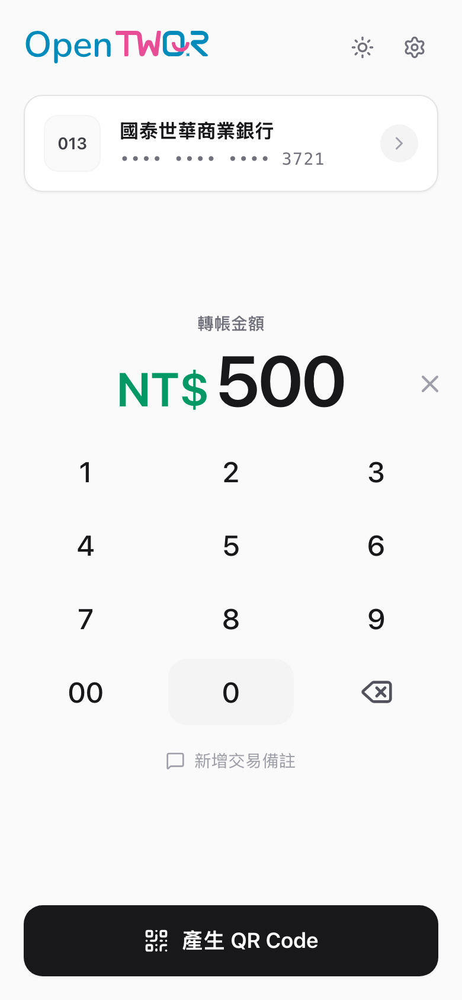

# OpenTWQR

**在你的手機上，即時產生台灣 Pay（TWQR）個人收款 QR Code。**

完全免費、開放原始碼、不需註冊、不會上傳資料——你的帳戶資訊只儲存在你自己的裝置上。

<p align="center">
  <picture>
    <source media="(prefers-color-scheme: dark)" srcset="public/screenshots/receive-dark.png" />
    
  </picture>
</p>

## 立即使用

前往 **[pay.garyellow.app](https://pay.garyellow.app)** 開始使用，無需安裝。

> 也可以將網頁「加入主畫面」，就像一般 App 一樣使用，離線也能產生收款碼。

## 功能特色

### 快速收款

1. 新增你的銀行帳戶
2. 輸入收款金額（或留空讓對方自行輸入）
3. 產生 QR Code，讓對方用任何支援台灣 Pay 的銀行 App 掃碼轉帳

### 多帳戶管理

可以新增多組銀行帳戶，並為每個帳戶設定暱稱（例如「郵局」、「薪轉戶」），一鍵切換收款帳戶。

### 安全分享

透過加密連結將收款碼分享給對方，即使經由第三方通訊軟體傳送，帳戶資訊也受到端對端加密保護。可選擇設定密碼與連結有效期。

### 離線可用

安裝為 App 後，即使沒有網路也能產生收款 QR Code——適合市集、擺攤等行動收款場景。

### 深色模式

支援淺色、深色與跟隨系統三種顯示模式。

## 隱私與安全

| | |
|---|---|
| **資料在哪裡** | 所有帳戶資料只儲存在你的裝置上，不會傳到任何伺服器 |
| **分享連結** | 使用 AES-256-GCM 端對端加密，解密金鑰保留在 URL 片段中（不會傳送至伺服器） |
| **密碼保護** | 可為分享連結設定密碼，採用 PBKDF2 600,000 次迭代防止暴力破解 |
| **連結有效期** | 可設定 10 分鐘、1 小時或 1 天自動失效 |
| **開放原始碼** | 程式碼完全公開，歡迎檢視與貢獻 |

## 常見問題

<details>
<summary><strong>這跟台灣 Pay App 有什麼不同？</strong></summary>

OpenTWQR 只負責「產生收款 QR Code」，讓對方用自己的銀行 App 掃碼付款。它不是一個支付 App，不會處理金流，也不需要你登入任何銀行帳號。
</details>

<details>
<summary><strong>對方需要安裝 OpenTWQR 嗎？</strong></summary>

不需要。對方只要用任何支援台灣 Pay（TWQR）的銀行 App 掃描 QR Code 就能轉帳。
</details>

<details>
<summary><strong>我的資料安全嗎？</strong></summary>

所有帳戶資料完全儲存在你的裝置上（瀏覽器的 IndexedDB），不會上傳到伺服器。分享連結採用端對端加密，即使連結經過伺服器，伺服器也看不到你的帳戶資訊。
</details>

<details>
<summary><strong>銀行清單多久更新一次？</strong></summary>

銀行清單資料來自財金資訊股份有限公司的公開資料，每日自動更新。App 內建清單確保離線也能使用。
</details>

<details>
<summary><strong>支援哪些瀏覽器？</strong></summary>

支援所有主流瀏覽器，包括 Chrome、Safari、Edge、Firefox。在 iOS Safari 或 Android Chrome 上可安裝為 PWA App。
</details>

## 開發

```bash
npm install     # 安裝依賴
npm run dev     # 啟動開發伺服器
npm run build   # 建置生產版本
npm run lint    # 程式碼檢查
```

## 授權

本專案為開放原始碼。
